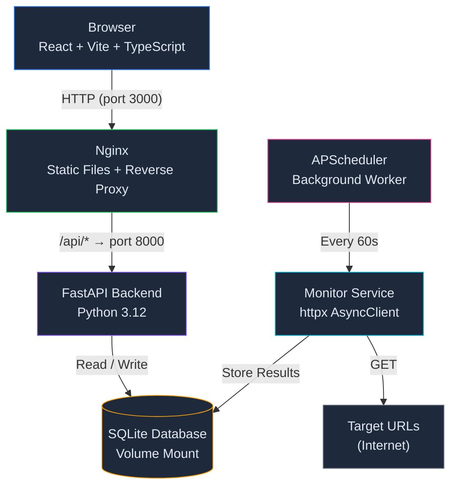
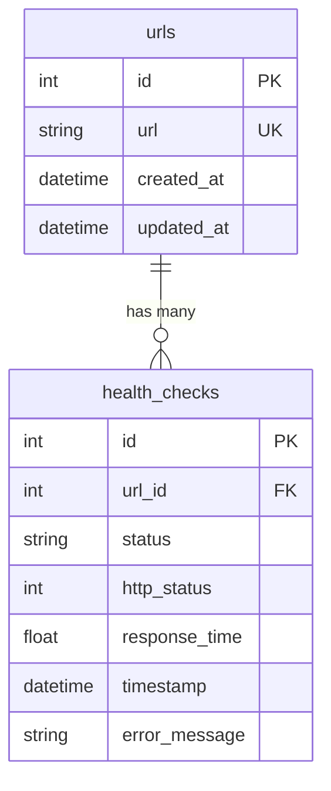
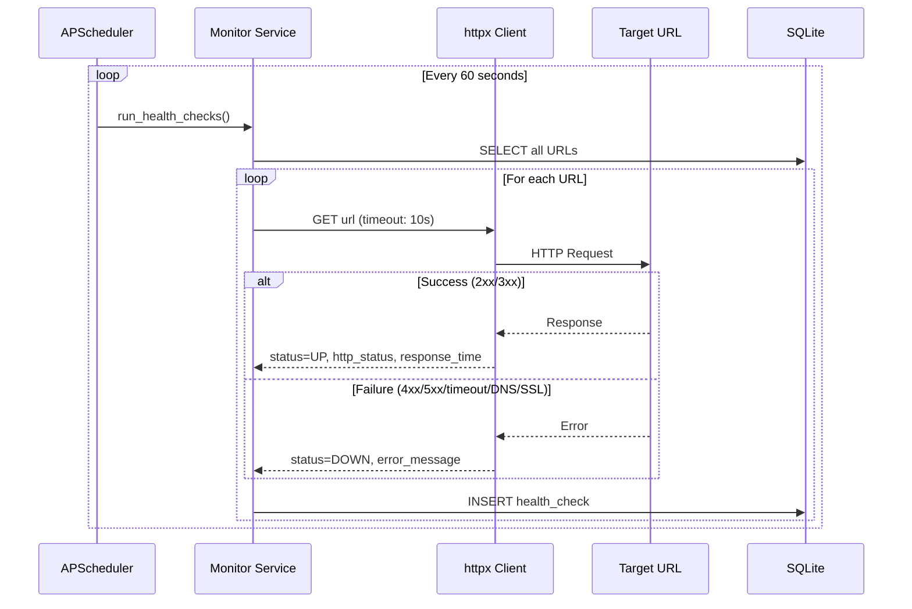

# 🟢 Uptime Monitor

A lightweight, full-stack uptime monitoring application that periodically pings registered URLs and displays whether each one is active, along with its response time.

Built as a polished MVP — beautifully simple, fully functional, zero complexity overhead.

---

## ✨ Features

- **URL Management** — Add, edit, and delete monitored URLs with duplicate prevention and validation
- **Automatic Monitoring** — Background scheduler pings all URLs every 60 seconds
- **Real-time Dashboard** — Live stats cards showing total URLs, healthy/failed counts, average response time, total checks, and last scan time
- **Health History** — Every check is stored as an immutable record; slide-out panel shows per-URL history with a response time sparkline
- **Status Indicators** — Animated green pulse (UP), red pulse (DOWN), yellow pulse (Pending)
- **Auto-refresh** — Frontend polls every 10 seconds with a visual "Checking..." indicator
- **Graceful Error Handling** — Timeouts, DNS failures, SSL errors, connection refused, HTTP errors — all handled without crashing
- **Dark Theme** — Premium glassmorphism UI inspired by Linear, Vercel, and GitHub
- **One-Command Setup** — `docker compose up` spins up the entire stack

---

## 🏗️ Architecture



---

## 📂 Folder Structure

```
uptime-monitor/
├── backend/
│   ├── app/
│   │   ├── api/              # FastAPI route handlers
│   │   │   ├── urls.py       # CRUD: POST/GET/PUT/DELETE /urls
│   │   │   └── dashboard.py  # GET /dashboard, /stats, /history, /healthchecks
│   │   ├── config/
│   │   │   └── settings.py   # Pydantic Settings (env vars)
│   │   ├── db/
│   │   │   └── database.py   # Async SQLAlchemy engine + session factory
│   │   ├── models/
│   │   │   ├── url.py        # URL table model
│   │   │   └── health_check.py # HealthCheck table model
│   │   ├── schemas/
│   │   │   ├── url.py        # Request/response schemas
│   │   │   └── health_check.py # Dashboard + health check schemas
│   │   ├── services/
│   │   │   └── monitor.py    # Core health check engine (httpx)
│   │   ├── scheduler/
│   │   │   └── scheduler.py  # APScheduler background job
│   │   ├── middleware/
│   │   │   └── error_handler.py # Global exception handler
│   │   ├── dependencies/
│   │   │   └── db.py         # DB session dependency injection
│   │   ├── utils/
│   │   │   └── logger.py     # Structured logging
│   │   └── main.py           # FastAPI app entrypoint
│   └── requirements.txt
├── frontend/
│   ├── src/
│   │   ├── components/       # React UI components
│   │   ├── pages/            # Dashboard page
│   │   ├── hooks/            # React Query hooks
│   │   ├── services/         # Axios API client
│   │   ├── lib/              # Utilities (cn, formatters)
│   │   └── types/            # TypeScript interfaces
│   ├── nginx.conf            # Production nginx config
│   ├── index.html
│   ├── tailwind.config.js
│   └── package.json
├── docker-compose.yml
├── Dockerfile.backend
├── Dockerfile.frontend
├── .env.example
├── .gitignore
├── README.md
└── AI_LOG.md
```

---

## 🛠️ Tech Stack

| Layer          | Technology                                                        |
|----------------|-------------------------------------------------------------------|
| **Frontend**   | React 18, TypeScript, Vite, TailwindCSS, Radix UI, Framer Motion |
| **State**      | TanStack React Query, React Hook Form                             |
| **Backend**    | FastAPI, Python 3.12, Pydantic v2, SQLAlchemy (async)             |
| **Database**   | SQLite (via aiosqlite)                                            |
| **Scheduler**  | APScheduler (AsyncIOScheduler)                                    |
| **HTTP Client**| httpx AsyncClient                                                 |
| **Infra**      | Docker, Docker Compose, Nginx                                     |

---

## 📡 API Documentation

All endpoints are prefixed with `/api`. Swagger docs are auto-generated at `http://localhost:8000/docs`.

| Method   | Endpoint              | Description                        |
|----------|-----------------------|------------------------------------|
| `POST`   | `/api/urls`           | Register a new URL for monitoring  |
| `GET`    | `/api/urls`           | List all URLs with latest status   |
| `PUT`    | `/api/urls/{id}`      | Update a monitored URL             |
| `DELETE` | `/api/urls/{id}`      | Delete a URL and its history       |
| `GET`    | `/api/dashboard`      | Aggregated dashboard metrics       |
| `GET`    | `/api/stats`          | Alias for /dashboard               |
| `GET`    | `/api/history/{id}`   | Health check history for a URL     |
| `GET`    | `/api/healthchecks`   | All recent health checks           |
| `GET`    | `/api/health`         | API liveness probe                 |

### Example: Add a URL

```bash
curl -X POST http://localhost:8000/api/urls \
  -H "Content-Type: application/json" \
  -d '{"url": "https://example.com"}'
```

---

## 🗄️ Database Schema



**Key design decisions:**
- Health checks are **append-only** — previous results are never overwritten
- `CASCADE` delete on `url_id` — removing a URL removes all its history
- Indexed on `url_id` and `timestamp` for efficient queries

---

## ⏱️ Scheduler Flow



---

## 🐳 Docker Setup

### Prerequisites

- [Docker](https://docs.docker.com/get-docker/) (20.10+)
- [Docker Compose](https://docs.docker.com/compose/install/) (v2+)

### 1-Line Setup

```bash
docker compose up --build
```

This starts:
- **Backend** → `http://localhost:8000` (FastAPI + Swagger at `/docs`)
- **Frontend** → `http://localhost:3000` (React dashboard)

### Stop

```bash
docker compose down
```

### Reset database

```bash
docker compose down -v
docker compose up --build
```

---

## 🧪 Testing Instructions

### Step 1: Start the application

```bash
docker compose up --build
```

### Step 2: Open the dashboard

Navigate to `http://localhost:3000` in your browser.

### Step 3: Add a healthy URL

Click **"Add URL"** and enter:
```
https://example.com
```

**Expected result:** After ~60 seconds (or on first startup check), the URL shows:
- Status: 🟢 **UP**
- HTTP Status: **200**
- Response Time: ~**100–500ms**
- Health: **100%**

### Step 4: Add a broken URL

Click **"Add URL"** and enter:
```
https://abcxyz123.invalid
```

**Expected result:** After the next check cycle:
- Status: 🔴 **DOWN**
- HTTP Status: **—**
- Error: **DNS resolution failed**
- Health: **0%**

### Step 5: Verify history

Click on any URL row to open the health history side panel. You should see:
- Individual check records with timestamps
- Response time sparkline chart
- Status, HTTP code, and response time per check

### Step 6: Verify auto-refresh

Wait 60+ seconds without refreshing the page. The dashboard should update automatically with new health check data. The header shows a spinning icon and "Checking..." during data fetches.

---

## 🚀 Deployment Sketch

### Cloud Architecture

```
GitHub Repository
        │
        ▼
  GitHub Actions (CI/CD)
        │
        ├─── Build Docker Images
        ├─── Push to ECR / Docker Hub
        │
        ▼
    AWS EC2 Instance
        │
        ├── Docker Compose
        │     ├── FastAPI Backend (port 8000)
        │     ├── React Frontend (port 3000)
        │     └── SQLite Volume (/data)
        │
        ▼
   Nginx Reverse Proxy
        │
        ▼
   HTTPS (Let's Encrypt / ACM)
```

### Hypothetical Terraform Sketch

```hcl
resource "aws_instance" "uptime_monitor" {
  ami           = "ami-0c55b159cbfafe1f0"  # Amazon Linux 2
  instance_type = "t3.micro"

  user_data = <<-EOF
    #!/bin/bash
    yum install -y docker
    systemctl start docker
    curl -L "https://github.com/docker/compose/releases/latest/download/docker-compose-$(uname -s)-$(uname -m)" -o /usr/local/bin/docker-compose
    chmod +x /usr/local/bin/docker-compose
    cd /opt/uptime-monitor
    docker-compose up -d
  EOF

  tags = { Name = "uptime-monitor" }
}

resource "aws_security_group" "web" {
  ingress {
    from_port   = 443
    to_port     = 443
    protocol    = "tcp"
    cidr_blocks = ["0.0.0.0/0"]
  }
  ingress {
    from_port   = 80
    to_port     = 80
    protocol    = "tcp"
    cidr_blocks = ["0.0.0.0/0"]
  }
}
```

### Future Migration Path

- **SQLite → PostgreSQL RDS**: Swap `DATABASE_URL` to `postgresql+asyncpg://...`; SQLAlchemy async engine handles the rest
- **Add Redis** for caching dashboard metrics if URL count grows past hundreds
- **Kubernetes** if horizontal scaling is needed (unlikely for this MVP scale)

---

## 🔧 Troubleshooting

| Issue | Solution |
|-------|---------|
| Port 3000/8000 already in use | Change ports in `docker-compose.yml` |
| Frontend shows "Network Error" | Ensure backend container is healthy: `docker compose ps` |
| Database locked errors | Restart the backend: `docker compose restart backend` |
| Stale data after restart | Clear volumes: `docker compose down -v && docker compose up --build` |
| Build fails on ARM Mac | Add `platform: linux/amd64` to services in `docker-compose.yml` |

---

## 📸 Screenshots

> Screenshots will be populated after running the application.

- **Dashboard** — Stats cards and URL monitoring table
- **Health Panel** — Slide-out history with sparkline
- **Add URL** — Modal with validation
- **Delete Confirmation** — Destructive action dialog

---

## 🔮 Future Improvements

- Email/Slack notifications on status changes
- Multi-user authentication
- Custom check intervals per URL
- Webhook integrations
- Response time percentile charts (p50, p95, p99)
- SSL certificate expiry monitoring
- Geographic ping distribution
- Export monitoring data to CSV

---

## 📄 License

MIT
